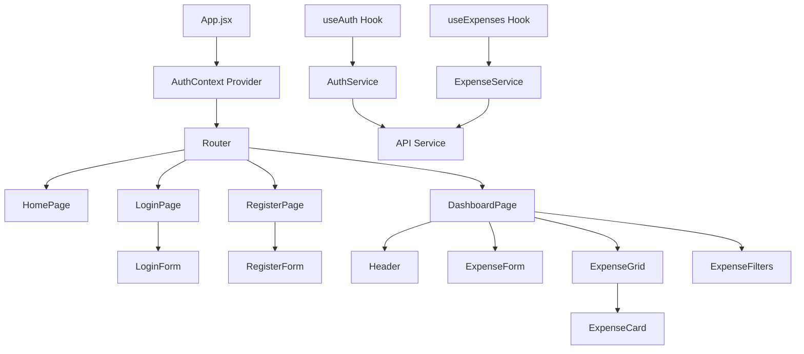
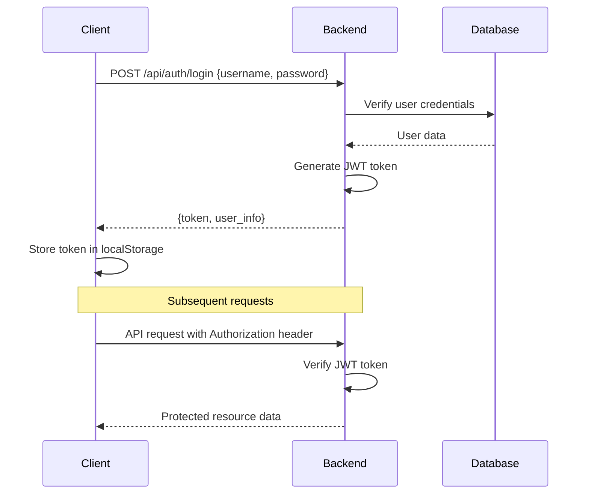
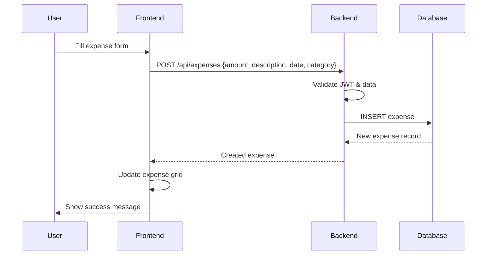

# Expense Tracker Application Architecture

## Overview

This document outlines the complete architecture for an Expense Tracker application designed as a demo project with modern web technologies. The application features user authentication, expense management with CRUD operations, and a responsive grid layout.

## Technology Stack

### Frontend
- **React 18** with functional components and hooks
- **CSS Flexbox** for responsive grid layouts
- **Axios** for API communication
- **React Router** for navigation
- **React Hook Form** for form management

### Backend
- **Spring Boot 3.x** (enterprise-grade Java framework)
- **Spring Security** with JWT authentication
- **Spring Web** for REST APIs and CORS configuration
- **Spring Data JPA** as ORM
- **Jackson** for JSON serialization/deserialization
- **Bean Validation** for input validation

### Database
- **H2 Database** for development (embedded, no setup required)
- **PostgreSQL** for production (easy migration path)

### Development Environment
- **DevContainer** with Java 17+ and Node.js 18
- **Docker Compose** for orchestrating services
- **Maven** for dependency management and build automation

## Project Directory Structure

```
expense-tracker/
├── .devcontainer/
│   ├── devcontainer.json
│   └── Dockerfile
├── backend/
│   ├── src/
│   │   ├── main/
│   │   │   ├── java/
│   │   │   │   └── com/
│   │   │   │       └── expensetracker/
│   │   │   │           ├── ExpenseTrackerApplication.java
│   │   │   │           ├── config/
│   │   │   │           │   ├── SecurityConfig.java
│   │   │   │           │   ├── CorsConfig.java
│   │   │   │           │   └── JwtConfig.java
│   │   │   │           ├── controller/
│   │   │   │           │   ├── AuthController.java
│   │   │   │           │   └── ExpenseController.java
│   │   │   │           ├── dto/
│   │   │   │           │   ├── request/
│   │   │   │           │   │   ├── LoginRequest.java
│   │   │   │           │   │   ├── RegisterRequest.java
│   │   │   │           │   │   └── ExpenseRequest.java
│   │   │   │           │   └── response/
│   │   │   │           │       ├── LoginResponse.java
│   │   │   │           │       ├── UserResponse.java
│   │   │   │           │       └── ExpenseResponse.java
│   │   │   │           ├── entity/
│   │   │   │           │   ├── User.java
│   │   │   │           │   └── Expense.java
│   │   │   │           ├── repository/
│   │   │   │           │   ├── UserRepository.java
│   │   │   │           │   └── ExpenseRepository.java
│   │   │   │           ├── service/
│   │   │   │           │   ├── UserService.java
│   │   │   │           │   ├── ExpenseService.java
│   │   │   │           │   └── JwtService.java
│   │   │   │           ├── security/
│   │   │   │           │   ├── JwtAuthenticationFilter.java
│   │   │   │           │   ├── JwtAuthenticationEntryPoint.java
│   │   │   │           │   └── UserPrincipal.java
│   │   │   │           ├── exception/
│   │   │   │           │   ├── GlobalExceptionHandler.java
│   │   │   │           │   ├── ResourceNotFoundException.java
│   │   │   │           │   └── BadRequestException.java
│   │   │   │           └── util/
│   │   │   │               ├── ExpenseCategory.java
│   │   │   │               └── DateUtil.java
│   │   │   └── resources/
│   │   │       ├── application.yml
│   │   │       ├── application-dev.yml
│   │   │       ├── application-prod.yml
│   │   │       └── data.sql
│   │   └── test/
│   │       └── java/
│   │           └── com/
│   │               └── expensetracker/
│   │                   ├── controller/
│   │                   ├── service/
│   │                   └── repository/
│   ├── pom.xml
│   └── .env.example
├── frontend/
│   ├── public/
│   │   ├── index.html
│   │   └── favicon.ico
│   ├── src/
│   │   ├── components/
│   │   │   ├── common/
│   │   │   │   ├── Header.jsx
│   │   │   │   ├── Loading.jsx
│   │   │   │   └── ErrorMessage.jsx
│   │   │   ├── auth/
│   │   │   │   ├── LoginForm.jsx
│   │   │   │   └── RegisterForm.jsx
│   │   │   └── expenses/
│   │   │       ├── ExpenseForm.jsx
│   │   │       ├── ExpenseGrid.jsx
│   │   │       ├── ExpenseCard.jsx
│   │   │       └── ExpenseFilters.jsx
│   │   ├── pages/
│   │   │   ├── HomePage.jsx
│   │   │   ├── LoginPage.jsx
│   │   │   ├── RegisterPage.jsx
│   │   │   └── DashboardPage.jsx
│   │   ├── services/
│   │   │   ├── api.js
│   │   │   ├── authService.js
│   │   │   └── expenseService.js
│   │   ├── context/
│   │   │   └── AuthContext.jsx
│   │   ├── hooks/
│   │   │   ├── useAuth.js
│   │   │   └── useExpenses.js
│   │   ├── utils/
│   │   │   ├── constants.js
│   │   │   └── helpers.js
│   │   ├── styles/
│   │   │   ├── global.css
│   │   │   ├── components/
│   │   │   └── pages/
│   │   ├── App.jsx
│   │   └── index.js
│   ├── package.json
│   └── .env.example
├── docker-compose.yml
├── README.md
└── .gitignore
```

## Database Schema Design

### Users Table
```sql
CREATE TABLE users (
    id BIGINT AUTO_INCREMENT PRIMARY KEY,
    username VARCHAR(80) UNIQUE NOT NULL,
    email VARCHAR(120) UNIQUE NOT NULL,
    password_hash VARCHAR(255) NOT NULL,
    created_at TIMESTAMP DEFAULT CURRENT_TIMESTAMP,
    updated_at TIMESTAMP DEFAULT CURRENT_TIMESTAMP ON UPDATE CURRENT_TIMESTAMP
);
```

### Expenses Table
```sql
CREATE TABLE expenses (
    id BIGINT AUTO_INCREMENT PRIMARY KEY,
    user_id BIGINT NOT NULL,
    amount DECIMAL(10, 2) NOT NULL,
    description VARCHAR(255) NOT NULL,
    category VARCHAR(50) NOT NULL,
    date DATE NOT NULL,
    created_at TIMESTAMP DEFAULT CURRENT_TIMESTAMP,
    updated_at TIMESTAMP DEFAULT CURRENT_TIMESTAMP ON UPDATE CURRENT_TIMESTAMP,
    FOREIGN KEY (user_id) REFERENCES users (id) ON DELETE CASCADE
);
```

### JPA Entity Relationships
```java
@Entity
@Table(name = "users")
public class User {
    @Id
    @GeneratedValue(strategy = GenerationType.IDENTITY)
    private Long id;
    
    @OneToMany(mappedBy = "user", cascade = CascadeType.ALL, fetch = FetchType.LAZY)
    private List<Expense> expenses;
    
    // other fields...
}

@Entity
@Table(name = "expenses")
public class Expense {
    @Id
    @GeneratedValue(strategy = GenerationType.IDENTITY)
    private Long id;
    
    @ManyToOne(fetch = FetchType.LAZY)
    @JoinColumn(name = "user_id", nullable = false)
    private User user;
    
    // other fields...
}
```

### Predefined Categories
- Food
- Transportation
- Entertainment
- Healthcare
- Shopping
- Utilities
- Other

## API Endpoint Specifications

### Authentication Endpoints

| Method | Endpoint | Description | Request Body | Response |
|--------|----------|-------------|--------------|----------|
| POST | `/api/auth/register` | Register new user | `{username, email, password}` | `{message, user_id}` |
| POST | `/api/auth/login` | User login | `{username, password}` | `{token, user_info}` |
| POST | `/api/auth/logout` | User logout | - | `{message}` |
| GET | `/api/auth/me` | Get current user | - | `{user_info}` |

### Expense Endpoints

| Method | Endpoint | Description | Request Body | Response |
|--------|----------|-------------|--------------|----------|
| GET | `/api/expenses` | Get user's expenses | Query params: `page`, `limit`, `category`, `date_from`, `date_to` | `{expenses[], total, page_info}` |
| POST | `/api/expenses` | Create new expense | `{amount, description, category, date}` | `{expense}` |
| GET | `/api/expenses/{id}` | Get specific expense | - | `{expense}` |
| PUT | `/api/expenses/{id}` | Update expense | `{amount, description, category, date}` | `{expense}` |
| DELETE | `/api/expenses/{id}` | Delete expense | - | `{message}` |
| GET | `/api/expenses/categories` | Get available categories | - | `{categories[]}` |

## Spring Boot Backend Implementation

### Core Components

#### Entity Classes
```java
@Entity
@Table(name = "users")
public class User {
    @Id
    @GeneratedValue(strategy = GenerationType.IDENTITY)
    private Long id;
    
    @Column(unique = true, nullable = false, length = 80)
    private String username;
    
    @Column(unique = true, nullable = false, length = 120)
    private String email;
    
    @Column(nullable = false)
    private String passwordHash;
    
    @CreationTimestamp
    private LocalDateTime createdAt;
    
    @UpdateTimestamp
    private LocalDateTime updatedAt;
    
    @OneToMany(mappedBy = "user", cascade = CascadeType.ALL, fetch = FetchType.LAZY)
    private List<Expense> expenses = new ArrayList<>();
}

@Entity
@Table(name = "expenses")
public class Expense {
    @Id
    @GeneratedValue(strategy = GenerationType.IDENTITY)
    private Long id;
    
    @Column(nullable = false, precision = 10, scale = 2)
    private BigDecimal amount;
    
    @Column(nullable = false)
    private String description;
    
    @Enumerated(EnumType.STRING)
    @Column(nullable = false)
    private ExpenseCategory category;
    
    @Column(nullable = false)
    private LocalDate date;
    
    @CreationTimestamp
    private LocalDateTime createdAt;
    
    @UpdateTimestamp
    private LocalDateTime updatedAt;
    
    @ManyToOne(fetch = FetchType.LAZY)
    @JoinColumn(name = "user_id", nullable = false)
    private User user;
}
```

#### Repository Interfaces
```java
@Repository
public interface UserRepository extends JpaRepository<User, Long> {
    Optional<User> findByUsername(String username);
    Optional<User> findByEmail(String email);
    boolean existsByUsername(String username);
    boolean existsByEmail(String email);
}

@Repository
public interface ExpenseRepository extends JpaRepository<Expense, Long> {
    Page<Expense> findByUserIdOrderByDateDesc(Long userId, Pageable pageable);
    Page<Expense> findByUserIdAndCategoryOrderByDateDesc(Long userId, ExpenseCategory category, Pageable pageable);
    Page<Expense> findByUserIdAndDateBetweenOrderByDateDesc(Long userId, LocalDate startDate, LocalDate endDate, Pageable pageable);
    List<Expense> findByUserIdAndDateBetween(Long userId, LocalDate startDate, LocalDate endDate);
}
```

#### Service Layer
```java
@Service
@Transactional
public class ExpenseService {
    private final ExpenseRepository expenseRepository;
    private final UserRepository userRepository;
    
    public Page<ExpenseResponse> getUserExpenses(Long userId, int page, int size, String category, LocalDate dateFrom, LocalDate dateTo) {
        Pageable pageable = PageRequest.of(page, size);
        Page<Expense> expenses;
        
        if (category != null && dateFrom != null && dateTo != null) {
            expenses = expenseRepository.findByUserIdAndCategoryAndDateBetweenOrderByDateDesc(
                userId, ExpenseCategory.valueOf(category), dateFrom, dateTo, pageable);
        } else if (category != null) {
            expenses = expenseRepository.findByUserIdAndCategoryOrderByDateDesc(
                userId, ExpenseCategory.valueOf(category), pageable);
        } else if (dateFrom != null && dateTo != null) {
            expenses = expenseRepository.findByUserIdAndDateBetweenOrderByDateDesc(
                userId, dateFrom, dateTo, pageable);
        } else {
            expenses = expenseRepository.findByUserIdOrderByDateDesc(userId, pageable);
        }
        
        return expenses.map(this::convertToResponse);
    }
}
```

#### REST Controllers
```java
@RestController
@RequestMapping("/api/auth")
@CrossOrigin(origins = "http://localhost:3000")
public class AuthController {
    private final UserService userService;
    private final JwtService jwtService;
    
    @PostMapping("/register")
    public ResponseEntity<RegisterResponse> register(@Valid @RequestBody RegisterRequest request) {
        User user = userService.registerUser(request);
        return ResponseEntity.ok(new RegisterResponse("User registered successfully", user.getId()));
    }
    
    @PostMapping("/login")
    public ResponseEntity<LoginResponse> login(@Valid @RequestBody LoginRequest request) {
        User user = userService.authenticateUser(request.getUsername(), request.getPassword());
        String token = jwtService.generateToken(user);
        return ResponseEntity.ok(new LoginResponse(token, convertToUserResponse(user)));
    }
}

@RestController
@RequestMapping("/api/expenses")
@CrossOrigin(origins = "http://localhost:3000")
public class ExpenseController {
    private final ExpenseService expenseService;
    
    @GetMapping
    public ResponseEntity<PagedResponse<ExpenseResponse>> getExpenses(
            @RequestParam(defaultValue = "0") int page,
            @RequestParam(defaultValue = "10") int size,
            @RequestParam(required = false) String category,
            @RequestParam(required = false) @DateTimeFormat(iso = DateTimeFormat.ISO.DATE) LocalDate dateFrom,
            @RequestParam(required = false) @DateTimeFormat(iso = DateTimeFormat.ISO.DATE) LocalDate dateTo,
            Authentication authentication) {
        
        Long userId = getUserIdFromAuthentication(authentication);
        Page<ExpenseResponse> expenses = expenseService.getUserExpenses(userId, page, size, category, dateFrom, dateTo);
        return ResponseEntity.ok(new PagedResponse<>(expenses));
    }
}
```

#### Security Configuration
```java
@Configuration
@EnableWebSecurity
@EnableMethodSecurity
public class SecurityConfig {
    
    @Bean
    public SecurityFilterChain filterChain(HttpSecurity http) throws Exception {
        http
            .csrf(csrf -> csrf.disable())
            .cors(cors -> cors.configurationSource(corsConfigurationSource()))
            .sessionManagement(session -> session.sessionCreationPolicy(SessionCreationPolicy.STATELESS))
            .authorizeHttpRequests(auth -> auth
                .requestMatchers("/api/auth/**").permitAll()
                .requestMatchers("/h2-console/**").permitAll()
                .anyRequest().authenticated()
            )
            .addFilterBefore(jwtAuthenticationFilter(), UsernamePasswordAuthenticationFilter.class)
            .exceptionHandling(ex -> ex.authenticationEntryPoint(jwtAuthenticationEntryPoint()));
        
        return http.build();
    }
    
    @Bean
    public CorsConfigurationSource corsConfigurationSource() {
        CorsConfiguration configuration = new CorsConfiguration();
        configuration.setAllowedOriginPatterns(Arrays.asList("http://localhost:3000"));
        configuration.setAllowedMethods(Arrays.asList("GET", "POST", "PUT", "DELETE", "OPTIONS"));
        configuration.setAllowedHeaders(Arrays.asList("*"));
        configuration.setAllowCredentials(true);
        
        UrlBasedCorsConfigurationSource source = new UrlBasedCorsConfigurationSource();
        source.registerCorsConfiguration("/api/**", configuration);
        return source;
    }
}
```

#### Application Configuration
```yaml
# application.yml
spring:
  application:
    name: expense-tracker
  profiles:
    active: dev
  jpa:
    hibernate:
      ddl-auto: update
    show-sql: true
    properties:
      hibernate:
        dialect: org.hibernate.dialect.H2Dialect
        format_sql: true
  h2:
    console:
      enabled: true
      path: /h2-console

server:
  port: 8080

jwt:
  secret: mySecretKey
  expiration: 900000 # 15 minutes

---
# application-dev.yml
spring:
  config:
    activate:
      on-profile: dev
  datasource:
    url: jdbc:h2:mem:expensedb
    driver-class-name: org.h2.Driver
    username: sa
    password:

---
# application-prod.yml
spring:
  config:
    activate:
      on-profile: prod
  datasource:
    url: ${DATABASE_URL:jdbc:postgresql://localhost:5432/expensetracker}
    username: ${DATABASE_USERNAME:postgres}
    password: ${DATABASE_PASSWORD:password}
    driver-class-name: org.postgresql.Driver
  jpa:
    hibernate:
      ddl-auto: validate
    database-platform: org.hibernate.dialect.PostgreSQLDialect
```

#### Maven Dependencies (pom.xml)
```xml
<dependencies>
    <dependency>
        <groupId>org.springframework.boot</groupId>
        <artifactId>spring-boot-starter-web</artifactId>
    </dependency>
    <dependency>
        <groupId>org.springframework.boot</groupId>
        <artifactId>spring-boot-starter-data-jpa</artifactId>
    </dependency>
    <dependency>
        <groupId>org.springframework.boot</groupId>
        <artifactId>spring-boot-starter-security</artifactId>
    </dependency>
    <dependency>
        <groupId>org.springframework.boot</groupId>
        <artifactId>spring-boot-starter-validation</artifactId>
    </dependency>
    <dependency>
        <groupId>io.jsonwebtoken</groupId>
        <artifactId>jjwt-api</artifactId>
        <version>0.11.5</version>
    </dependency>
    <dependency>
        <groupId>io.jsonwebtoken</groupId>
        <artifactId>jjwt-impl</artifactId>
        <version>0.11.5</version>
    </dependency>
    <dependency>
        <groupId>io.jsonwebtoken</groupId>
        <artifactId>jjwt-jackson</artifactId>
        <version>0.11.5</version>
    </dependency>
    <dependency>
        <groupId>com.h2database</groupId>
        <artifactId>h2</artifactId>
        <scope>runtime</scope>
    </dependency>
    <dependency>
        <groupId>org.postgresql</groupId>
        <artifactId>postgresql</artifactId>
        <scope>runtime</scope>
    </dependency>
    <dependency>
        <groupId>org.springframework.boot</groupId>
        <artifactId>spring-boot-devtools</artifactId>
        <scope>runtime</scope>
        <optional>true</optional>
    </dependency>
</dependencies>
```

## Frontend Component Architecture



### Component Responsibilities

#### Pages
- **HomePage**: Landing page with app overview
- **LoginPage**: User authentication
- **RegisterPage**: User registration
- **DashboardPage**: Main expense management interface

#### Components
- **Header**: Navigation and user info
- **ExpenseForm**: Add/edit expense form
- **ExpenseGrid**: Display expenses in responsive grid
- **ExpenseCard**: Individual expense item
- **ExpenseFilters**: Filter expenses by category/date

#### Services
- **authService**: Handle authentication logic
- **expenseService**: Manage expense CRUD operations
- **api**: Centralized API configuration

#### Hooks
- **useAuth**: Authentication state management
- **useExpenses**: Expense data management

## Authentication Flow



## Expense Management Flow



## DevContainer Configuration

### Features
- Java 17+ with Spring Boot development server
- Node.js 18 for React development
- H2 Database for development (embedded, no additional setup required)
- Maven for dependency management and build automation
- Git configuration
- VS Code extensions for Java, Spring Boot, and React development

### Development Ports
- Frontend: `http://localhost:3000`
- Backend API: `http://localhost:8080`
- H2 Database Console: `http://localhost:8080/h2-console` (development only)

## Error Handling Strategy

### Backend Error Handling
- **Validation Errors** (400): Detailed field-level error messages
- **Authentication Errors** (401): Invalid credentials or missing token
- **Authorization Errors** (403): Valid token but insufficient permissions
- **Not Found Errors** (404): Resource doesn't exist
- **Server Errors** (500): Unexpected server issues

### Frontend Error Handling
- Global error boundary for React component errors
- API error interceptors in Axios for consistent error handling
- User-friendly error messages with actionable feedback
- Loading states for all async operations
- Form validation with real-time feedback

## Security Considerations

### JWT Token Management
- Short token expiration (15 minutes)
- Secure token storage in localStorage
- Automatic token refresh mechanism
- Token blacklisting on logout

### Input Validation
- Server-side validation for all inputs
- Sanitization of user data
- SQL injection prevention via SQLAlchemy ORM
- Cross-site scripting (XSS) protection

### CORS Configuration
- Restrict origins in production environment using Spring Web CORS configuration
- Proper headers configuration with `@CrossOrigin` annotations or global configuration
- Credential handling for authentication with Spring Security

## Responsive Grid Layout Strategy

### Flexbox Implementation
- **Mobile-first responsive design**
- **Expense cards in flexible grid layout**
- **Breakpoints**: 
  - Mobile: `< 768px` (1 column)
  - Tablet: `768px - 1024px` (2 columns)
  - Desktop: `> 1024px` (3+ columns)

### CSS Grid Structure
```css
.expense-grid {
  display: flex;
  flex-wrap: wrap;
  gap: 1rem;
  padding: 1rem;
}

.expense-card {
  flex: 1 1 300px;
  min-width: 280px;
  max-width: 400px;
}

@media (max-width: 768px) {
  .expense-card {
    flex: 1 1 100%;
  }
}
```

## Development Workflow

### Setup Process
1. Clone repository
2. Open in DevContainer (VS Code will handle setup automatically)
3. Backend setup runs automatically via DevContainer
4. Frontend dependencies installed automatically

### Development Process
1. **Backend Development**:
   - Spring Boot development server with hot reload using Spring Boot DevTools
   - JPA/Hibernate automatic schema generation and updates
   - Unit and integration testing with JUnit 5 and Spring Boot Test
   - API documentation with SpringDoc OpenAPI (Swagger UI)

2. **Frontend Development**:
   - React development server with hot reload
   - Component development with React Developer Tools
   - Responsive design testing with browser dev tools

3. **Integration Testing**:
   - End-to-end testing of authentication flow
   - CRUD operations testing with TestContainers
   - Responsive design verification

### Deployment Strategy
- Docker containerization for production with multi-stage builds
- Environment-specific configuration files (application-{profile}.yml)
- JPA/Hibernate automatic database schema management
- CI/CD pipeline ready structure with Maven build profiles

## Performance Considerations

### Backend Optimization
- Database indexing on user_id and date fields with JPA @Index annotations
- Pagination for expense lists using Spring Data JPA Pageable
- Caching for category lists using Spring Cache abstraction
- Connection pooling with HikariCP (default in Spring Boot)
- JVM optimization for production deployments

### Frontend Optimization
- Code splitting with React.lazy()
- Memoization for expensive calculations
- Debounced search and filtering
- Optimistic UI updates for better UX

## Future Enhancement Opportunities

### Potential Features
- Expense analytics and reporting
- Budget tracking and alerts
- Receipt photo upload and OCR
- Multi-currency support
- Data export (CSV, PDF)
- Mobile app with React Native

### Scalability Considerations
- Database migration to PostgreSQL
- Redis for session management
- CDN for static assets
- Load balancing for multiple instances
- Microservices architecture for larger scale

---

This architecture provides a solid foundation for the Expense Tracker application while maintaining simplicity for a demo project. The modular structure allows for easy expansion and modification as requirements evolve.